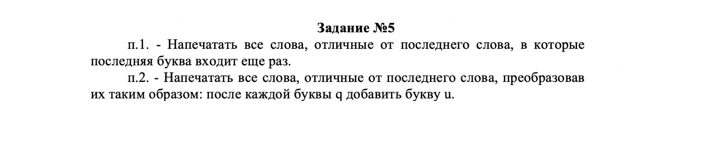

# **Задание 5**

​

> Delphi
```Delphi
 program laba7;

{$APPTYPE CONSOLE}
{$R *.res}

uses
  System.SysUtils, windows;

TYPE
  Arr = array [1 .. 255] of string;

var
  s, temp: string;
  ArrOfString: Arr;
  i: integer;
  lastWord, letter: string;
  flag: boolean;
  j, k, h: integer;
  NumberOfWords: integer;

procedure restouration(var s: string);
begin

  i := 1;
  while i <= Length(s) do
  begin
    if (s[i] = ' ') and (s[i + 1] = ' ') then
      delete(s, i + 1, 1)
    else
      Inc(i);
  end;
end;

procedure getArrayOfString(var s: string; var arrOfStr: Arr);
var
  counter, j, k: integer;
  temp: string;
  lastWord: string;
begin
  j := 0;
  counter := Length(s) - 1;
  while s[counter] <> ' ' do
    dec(counter);

  Inc(counter);
  lastWord := copy(s, counter, Length(s) - counter + 1);

  while Length(s) > 0 do
  begin

    counter := 0;
    while s[counter] <> ' ' do
      Inc(counter);

    temp := copy(s, 0, counter - 1);
    delete(s, 1, counter);
    if temp <> lastWord then
    begin
      Inc(j);
      arrOfStr[j] := temp;

    end;

  end;
  for k := 1 to j do
    NumberOfWords := j;

end;

procedure p1(var arrOfStr: Arr);
var
  i: integer;
  lastSymbol: string;
  word: string;
begin

  for i := 1 to NumberOfWords do
  begin
    lastSymbol := arrOfStr[i][Length(arrOfStr[i])];
    delete(arrOfStr[i], Length(arrOfStr[i]), 1);

    if pos(lastSymbol, arrOfStr[i]) > 0 then
      write(concat(arrOfStr[i], lastSymbol), ' ')
    else
      arrOfStr[i] := arrOfStr[i] + lastSymbol;

  end;

end;

procedure p2(var ArrOfString: Arr);
var
  counter: integer;
begin

  j := 1;
  i := 1;
  while i <= Length(ArrOfString) do
  begin
    counter := 0;
    for j := 1 to Length(ArrOfString[i]) do
    begin

      if ArrOfString[i][j + counter] = 'q' then
      begin
        insert('u', ArrOfString[i], j + counter + 1);
        Inc(counter);
      end
      else if (ArrOfString[i][j + counter] = 'q') and
        (j = Length(ArrOfString[i])) then
        ArrOfString[i] := ArrOfString[i] + 'u';
    end;

    Inc(i);
  end;

  for i := 1 to NumberOfWords do
    write(ArrOfString[i], ' ');

end;

begin
  SetConsoleCP(1251);
  SetConsoleOutPutCP(1251);
  writeln('Введиту строку на латинском:');
  readln(s);

  if s = '' then
    writeln('Строка оказалась пустой, попробуйте еще раз!', s);

  s := trim(s);
  restouration(s);
  getArrayOfString(s, ArrOfString);

  writeln;
  writeln('строка, отвечающая требованиям первого условия:');
  p1(ArrOfString);

  if ArrOfString[1] = '' then
    writeln('Строка оказалась пустой, попробуйте еще раз!', ArrOfString[1]);
  writeln;
  writeln;

  writeln('строка, отвечающая требованиям второго условия:');
  p2(ArrOfString);

  if ArrOfString[1] = '' then
    writeln('Строка оказалась пустой, попробуйте еще раз!', ArrOfString[1]);

  readln;
end.

```
